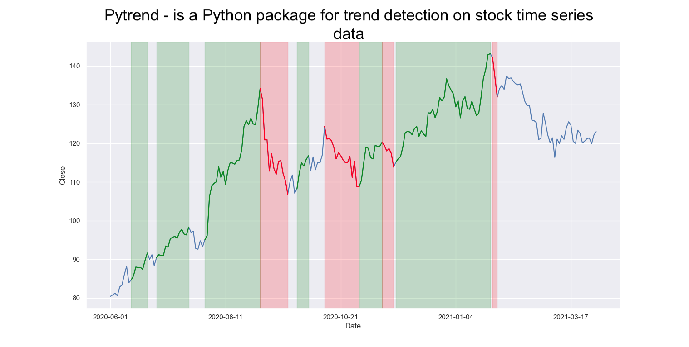

# Pytrend - Trend detection on stock time series data

<p align="center">
  
</p>

## Introduction

**pytrend** is a Python package to detect trends on the market so to analyze its behaviour. So on, this package
has been created to support Yahoo Finance features when it comes to data retrieval
from different financial products such as stocks, funds or ETFs; and it is intended to be combined with it, 
but also with every `pandas.DataFrame`, formatted as OHLC.

Anyways, **pytrend** can also be used to identify trends from any `pandas.DataFrame` which contains any column with
`int64` or `float64` values, even though it is intended to be used with stock data; it can also be used for any
`pandas.DataFrame`.

## Installation

In order to get this package working you will need to install it using pip by typing on the terminal:

```
$ python -m pip install pytrend --upgrade
```

Or just install the current release or a specific release version such as:

```
$ python -m pip install pytrend==0.3
```

Or install from the source

```
$ git clone https://github.com/dopevog/pytrend.git
$ cd pytrend
$ python setup.py install
```

## Usage

As **pytrend** is intended to be combined with **investpy**, the main functionality is to
detect trends on stock time series data so to analyse the market and which behaviour does it have
in certain date ranges.

In the example presented below, the ``identify_all_trends`` function will be used to detect every bearish/bullish trend
with a time window above 5 days, which, for example, implies that every bearish (decreasing) trend with a longer
length than 5 days will be identified as a down trend and so on added to a ``pandas.DataFrame`` which already contains
OHLC values, in new columns called **Up Trend** and **Down Trend** which will be labeled as specified, with letters 
from A to Z by default.

````python
import pytrend

import matplotlib.pyplot as plt
import seaborn as sns

sns.set(style='darkgrid')

df = pytrend.identify_all_trends(stock='AAPl',
                                 from_date='06/01/2020',
                                 to_date='04/01/2021',
                                 window_size=5,
                                 identify='both')

df.reset_index(inplace=True)

plt.figure(figsize=(20, 10))

ax = sns.lineplot(x=df.index, y=df['Close'])
ax.set(xlabel='Date')

labels = df['Up Trend'].dropna().unique().tolist()

for label in labels:
    sns.lineplot(x=df[df['Up Trend'] == label].index,
                 y=df[df['Up Trend'] == label]['Close'],
                 color='green')

    ax.axvspan(df[df['Up Trend'] == label].index[0],
               df[df['Up Trend'] == label].index[-1],
               alpha=0.2,
               color='green')

labels = df['Down Trend'].dropna().unique().tolist()

for label in labels:
    sns.lineplot(x=df[df['Down Trend'] == label].index,
                 y=df[df['Down Trend'] == label]['Close'],
                 color='red')

    ax.axvspan(df[df['Down Trend'] == label].index[0],
               df[df['Down Trend'] == label].index[-1],
               alpha=0.2,
               color='red')
               
locs, _ = plt.xticks()
labels = []

for position in locs[1:-1]:
    labels.append(str(df['Date'].loc[position])[:-9])

plt.xticks(locs[1:-1], labels)
plt.show()
````

Further usage insights can be found on the [docs](https://pytrend.readthedocs.io/). Anyways, 
feel free to create your own scripts on how you use **pytrend** or how can it be used in order to improve its features.

## License
This Project Has Been [MIT Licensed](LICENSE)
